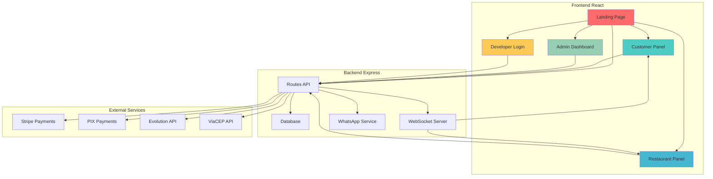
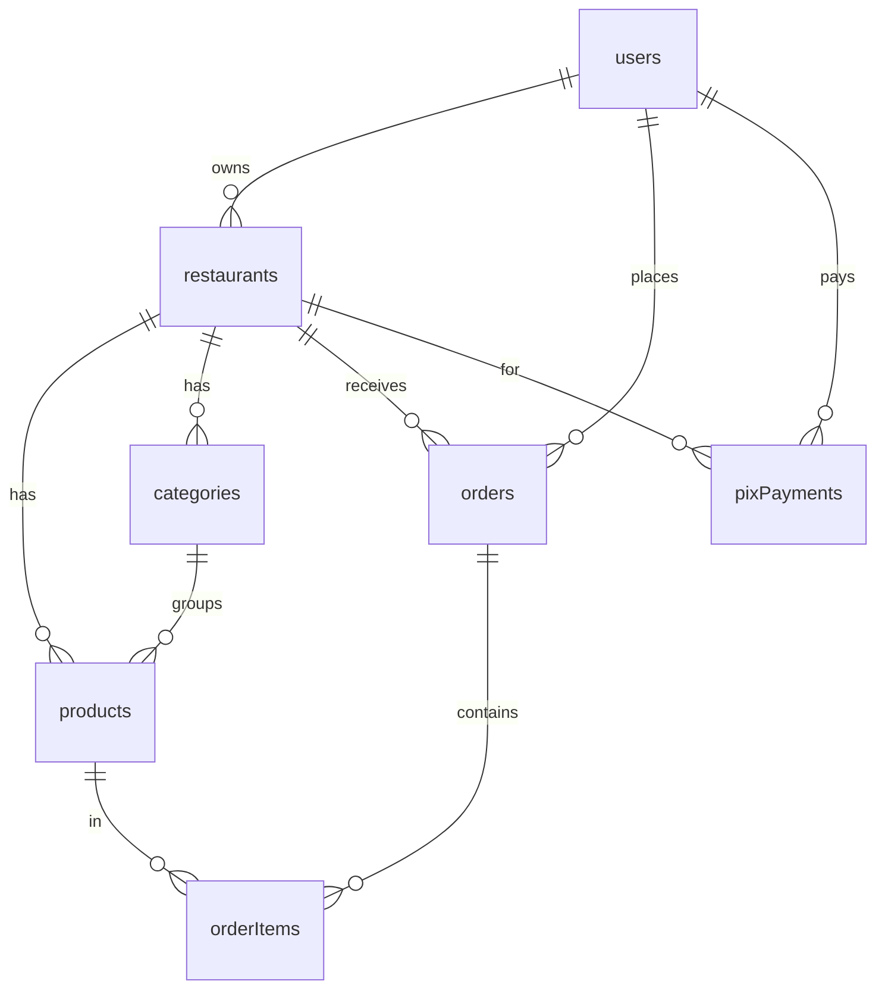
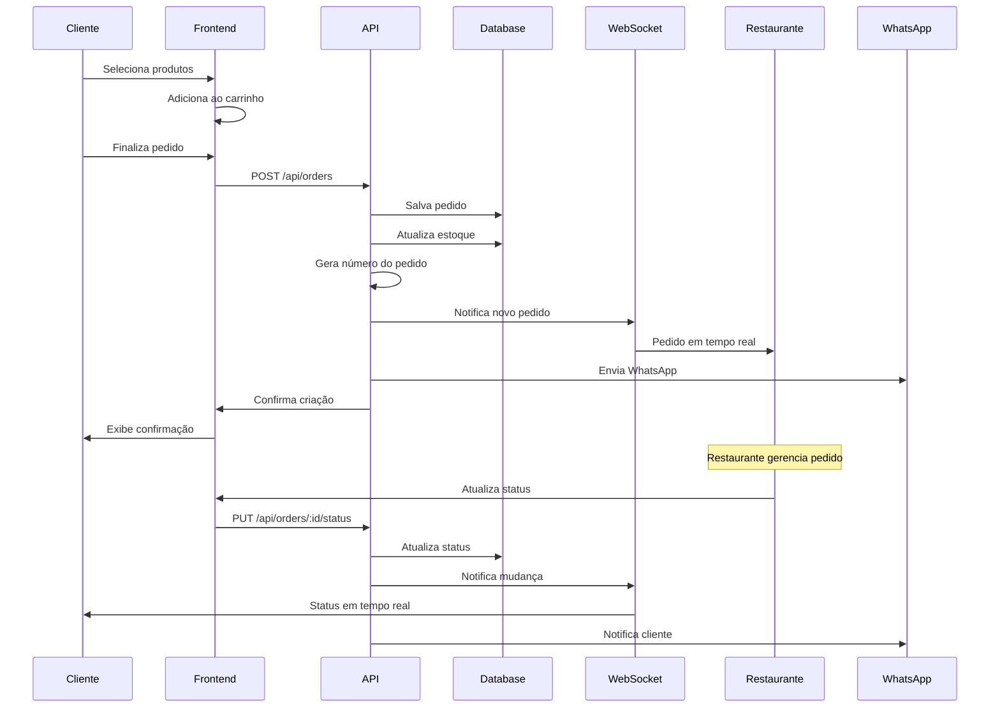
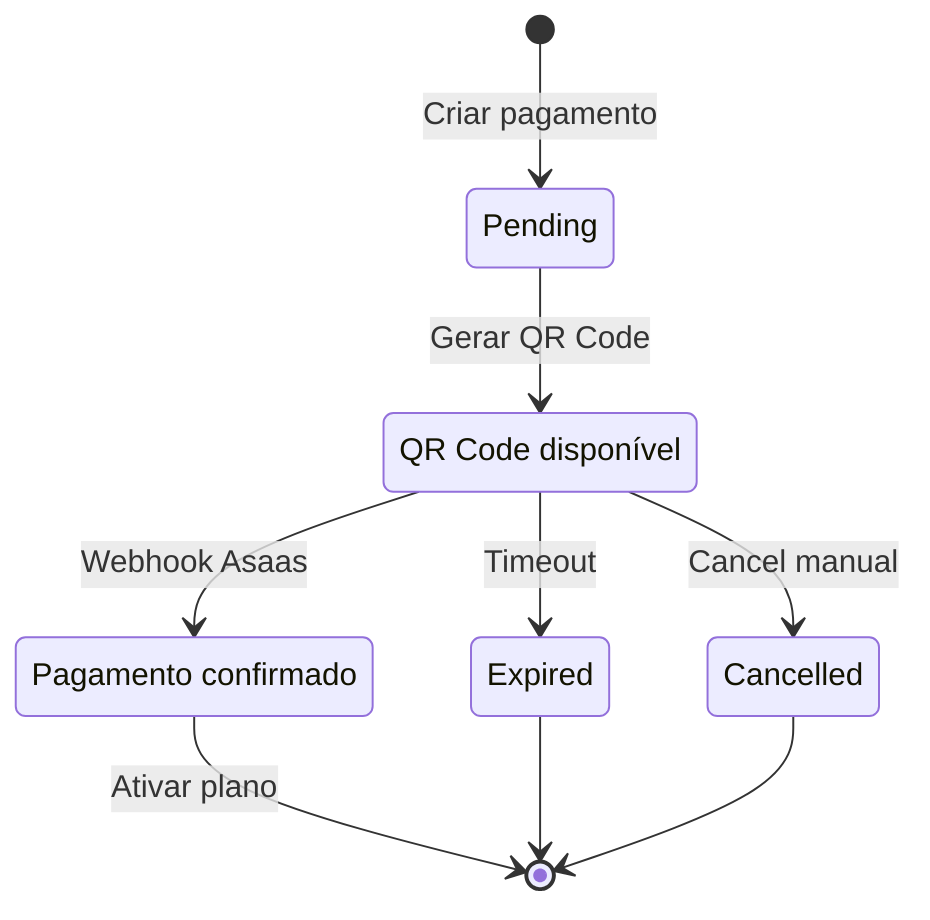
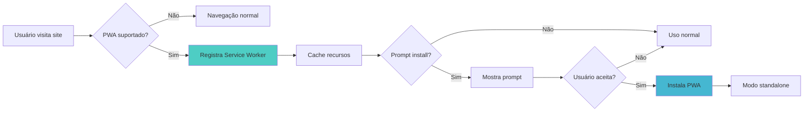

# 🚀 Manual Completo do Desenvolvedor - GoFood Platform

<div align="center">


**🎯 Sistema Completo de Delivery/Restaurante com PWA e Real-time**

*Desenvolvido em TypeScript + React + Express.js + PostgreSQL*

</div>

---

## 📋 Índice de Conteúdo

<details>
<summary><strong>🧭 NAVEGAÇÃO RÁPIDA</strong></summary>

- [🏠 **Portal do Cliente**](#-portal-do-cliente)
- [🍴 **Portal do Restaurante**](#-portal-do-restaurante) 
- [👨‍💼 **Portal do Administrador**](#-portal-do-administrador)
- [👨‍💻 **Portal do Desenvolvedor**](#-portal-do-desenvolvedor)

</details>

### 📚 Seções Principais

1. [🎯 **Arquitetura Geral**](#-arquitetura-geral)
2. [📱 **Catálogo Completo de Páginas**](#-catálogo-completo-de-páginas)
3. [⚡ **Matriz de Funcionalidades**](#-matriz-de-funcionalidades)
4. [🗃️ **Inventário de APIs**](#-inventário-de-apis)
5. [💾 **Modelos de Dados**](#-modelos-de-dados)
6. [🔄 **Workflows e Fluxos**](#-workflows-e-fluxos)
7. [🎨 **Componentes e UI**](#-componentes-e-ui)
8. [🔐 **Segurança e Autenticação**](#-segurança-e-autenticação)
9. [⚙️ **Configurações e Ambiente**](#-configurações-e-ambiente)
10. [🧪 **Testes e Debugging**](#-testes-e-debugging)
11. [📈 **Monitoramento e Logs**](#-monitoramento-e-logs)
12. [🛠️ **Troubleshooting**](#-troubleshooting)

---

## 🎯 Arquitetura Geral



### 🏗️ Stack Tecnológico

| Categoria | Tecnologia | Versão | Função |
|-----------|------------|--------|---------|
| 🖥️ **Frontend** | React + TypeScript | 18.x | Interface do usuário |
| 🚀 **Build Tool** | Vite | 5.x | Bundler e dev server |
| 🎨 **UI Framework** | TailwindCSS + Shadcn/UI | 3.x | Styling e componentes |
| 🔄 **State Management** | TanStack Query | 5.x | Cache e sync de dados |
| 🌐 **Routing** | Wouter | 3.x | Roteamento SPA |
| ⚙️ **Backend** | Express.js + TypeScript | 4.x | Servidor API |
| 🗄️ **Database** | PostgreSQL + Drizzle ORM | 15.x | Persistência de dados |
| 🔐 **Auth** | Replit Auth + Local Auth | - | Autenticação |
| 📡 **Real-time** | WebSockets | - | Comunicação em tempo real |
| 💳 **Pagamentos** | Stripe + PIX (Asaas) | - | Processamento de pagamentos |
| 📱 **PWA** | Service Worker | - | App offline |
| 📞 **WhatsApp** | Evolution API | - | Notificações |

---

## 📱 Catálogo Completo de Páginas

### 🏠 Portal do Cliente

<details>
<summary><strong>🎯 Páginas Públicas</strong></summary>

#### 🌟 **Landing Page** - `/`
- **📄 Arquivo**: `client/src/pages/landing.tsx`
- **🎯 Propósito**: Página inicial com busca de restaurantes e categorias
- **🧩 Componentes Principais**:
  - Hero section com busca por CEP/endereço
  - Categorias de restaurantes (Pizza, Hambúrguer, Japonesa, etc.)
  - Grid de restaurantes em destaque
  - Seção CTA para restaurantes
- **📡 APIs Utilizadas**:
  - `GET /api/restaurants` - Busca restaurantes
- **🔑 Query Keys**: `["/api/restaurants", { search, category }]`
- **🌐 WebSocket**: Não utiliza
- **🧪 Test IDs**: `hero-title`, `category-{value}`, `button-bring-restaurant`
- **🎨 Características**:
  - ✅ SEO otimizado
  - ✅ Dark mode support
  - ✅ Responsive design
  - ✅ Busca por CEP integrada com ViaCEP

#### 🍽️ **Menu do Restaurante** - `/restaurant/:restaurantId` e `/menu/:restaurantId`
- **📄 Arquivo**: `client/src/pages/menu.tsx`
- **🎯 Propósito**: Cardápio público do restaurante com carrinho de compras
- **🧩 Componentes Principais**:
  - Header do restaurante com info e horários
  - Categorias de produtos
  - Grid de produtos com filtros
  - Carrinho lateral/modal
  - Formulário de pedido
- **📡 APIs Utilizadas**:
  - `GET /api/restaurants/:id` - Dados do restaurante
  - `GET /api/restaurants/:id/products` - Produtos
  - `GET /api/restaurants/:id/categories` - Categorias
  - `POST /api/orders` - Criar pedido
- **🔑 Query Keys**: `["/api/restaurants", id]`, `["/api/restaurants", id, "products"]`
- **🌐 WebSocket**: Conecta para atualizações de estoque em tempo real
- **🧪 Test IDs**: `product-card-{id}`, `button-add-to-cart`, `checkout-form`

</details>

<details>
<summary><strong>👤 Área do Cliente</strong></summary>

#### 🏪 **Cadastro de Cliente** - `/register`
- **📄 Arquivo**: `client/src/pages/register.tsx`
- **🎯 Propósito**: Cadastro inicial de novos usuários
- **🧩 Componentes Principais**:
  - Formulário de dados pessoais
  - Seleção de tipo de usuário (Cliente/Restaurante)
  - Validação em tempo real
- **📡 APIs Utilizadas**:
  - `POST /api/users` - Criar usuário
- **🧪 Test IDs**: `input-email`, `input-phone`, `button-register`

#### 🔐 **Login** - `/login`
- **📄 Arquivo**: `client/src/pages/login.tsx`
- **🎯 Propósito**: Seleção de tipo de login
- **🧩 Componentes Principais**:
  - Cards de seleção (Cliente/Restaurante)
  - Integração Replit Auth
  - Login local para funcionários
- **🔑 Fluxos de Auth**:
  - 🟢 Replit Auth (produção)
  - 🟡 Dev Auth (desenvolvimento)
  - 🔵 Local Auth (funcionários)

#### 🏠 **Painel do Cliente** - `/customer-panel`
- **📄 Arquivo**: `client/src/pages/customer-panel.tsx`
- **🎯 Propósito**: Dashboard pessoal do cliente
- **🧩 Componentes Principais**:
  - Histórico de pedidos
  - Status de pedidos em tempo real
  - Restaurantes favoritos
  - Chat com restaurantes
- **📡 APIs Utilizadas**:
  - `GET /api/customer/orders` - Histórico de pedidos
  - `GET /api/orders/:id/messages` - Mensagens do pedido
  - `POST /api/orders/:id/messages` - Enviar mensagem
- **🌐 WebSocket**: `{ userType: 'customer', userId: user.id }`
- **🧪 Test IDs**: `order-card-{id}`, `message-input`, `status-{status}`

</details>

### 🍴 Portal do Restaurante

<details>
<summary><strong>🏪 Gestão do Restaurante</strong></summary>

#### 📝 **Cadastro de Restaurante** - `/restaurant-register`
- **📄 Arquivo**: `client/src/pages/restaurant-register.tsx`
- **🎯 Propósito**: Registro inicial de novos restaurantes
- **🧩 Componentes Principais**:
  - Formulário de dados do restaurante
  - Upload de logo e banner
  - Configuração inicial
- **📡 APIs Utilizadas**:
  - `POST /api/restaurants` - Criar restaurante

#### ⚙️ **Setup do Restaurante** - `/setup-restaurant`
- **📄 Arquivo**: `client/src/pages/setup-restaurant.tsx`
- **🎯 Propósito**: Configuração detalhada pós-cadastro
- **🧩 Componentes Principais**:
  - Formulário detalhado
  - Configuração de entrega
  - Horários de funcionamento
  - Áreas de atendimento

#### 🏢 **Painel do Restaurante** - `/restaurant-panel`
- **📄 Arquivo**: `client/src/pages/restaurant-panel.tsx`
- **🎯 Propósito**: Dashboard principal do restaurante
- **🧩 Componentes Principais**:
  - Lista de pedidos em tempo real
  - Controle de status de pedidos
  - Chat com clientes
  - Notificações sonoras
- **📡 APIs Utilizadas**:
  - `GET /api/my-orders` - Pedidos do restaurante
  - `PUT /api/orders/:id/status` - Atualizar status
  - `GET /api/orders/:id/messages` - Mensagens
- **🌐 WebSocket**: `{ userType: 'restaurant', userId: ownerId }`
- **🧪 Test IDs**: `order-{id}`, `status-select`, `message-thread`

#### 📊 **Dashboard Completo** - `/dashboard`
- **📄 Arquivo**: `client/src/pages/dashboard.tsx`
- **🎯 Propósito**: Interface completa de gestão
- **🧩 Componentes Principais**:
  - Abas: Comandas, Produtos, Categorias, Adicionais, Mesas, Cupons
  - Gestão de cardápio
  - Controle de estoque
  - Configurações do restaurante
- **📡 APIs Utilizadas**: Múltiplas (listadas na seção de APIs)

#### 📈 **Painel de Controle** - `/controle`
- **📄 Arquivo**: `client/src/pages/controle.tsx`
- **🎯 Propósito**: Analytics e relatórios detalhados
- **🧩 Componentes Principais**:
  - Métricas de receita e vendas
  - Relatórios de lucro por produto
  - Gráficos de performance
  - Top produtos mais lucrativos
- **📡 APIs Utilizadas**:
  - `GET /api/restaurant/stats` - Estatísticas
  - `GET /api/restaurant/profit-report` - Relatório de lucro
- **🎨 Características**:
  - 📊 Charts interativos (Recharts)
  - 📱 PWA install prompt
  - 🔄 Dados em tempo real

</details>

### 👨‍💼 Portal do Administrador

<details>
<summary><strong>🛡️ Sistema Administrativo</strong></summary>

#### 🔐 **Login de Desenvolvedor** - `/desenvolvedor`
- **📄 Arquivo**: `client/src/pages/desenvolvedor.tsx`
- **🎯 Propósito**: Autenticação administrativa segura
- **🧩 Componentes Principais**:
  - Formulário de login com tema dark
  - Validação de credenciais admin
  - Design profissional com gradientes
- **📡 APIs Utilizadas**:
  - `POST /api/admin/login` - Login administrativo
- **🎨 Design**: 
  - 🌙 Tema dark premium
  - 🎨 Gradientes purple/blue
  - 🛡️ Ícones de segurança
- **🧪 Test IDs**: `input-username`, `input-password`, `button-admin-login`

#### 👨‍💼 **Dashboard Administrativo** - `/admin-dashboard`
- **📄 Arquivo**: `client/src/pages/admin-dashboard.tsx`
- **🎯 Propósito**: Central de controle do sistema
- **🧩 Componentes Principais**:
  - 📊 **Dashboard**: Métricas gerais do sistema
  - 🏪 **Restaurantes**: Gestão de todos os restaurantes
  - 👥 **Usuários**: Administração de usuários
  - 📦 **Planos**: Gestão de planos de assinatura
  - ⚙️ **Funcionalidades**: Controle de features
  - 💳 **Pagamentos**: Gestão de pagamentos PIX
- **📡 APIs Utilizadas**:
  - `GET /api/admin/dashboard` - Estatísticas gerais
  - `GET /api/admin/restaurants` - Lista restaurantes
  - `GET /api/admin/users` - Lista usuários
  - `GET /api/admin/plans` - Planos de assinatura
  - `GET /api/admin/payments` - Pagamentos PIX
  - `POST /api/admin/payments/:id/confirm` - Confirmar pagamento
- **🔑 Funcionalidades Especiais**:
  - ✅ Confirmação manual de pagamentos PIX
  - 📊 Relatórios de trial expirados
  - 🔍 Busca avançada por restaurantes/usuários
  - ⚡ Status de pagamentos em tempo real

</details>

### 💼 Páginas de Negócio

<details>
<summary><strong>💰 Sistema de Vendas e Assinaturas</strong></summary>

#### 🎯 **Página de Vendas** - `/sales`
- **📄 Arquivo**: `client/src/pages/sales.tsx`
- **🎯 Propósito**: Landing page comercial para restaurantes
- **🧩 Componentes Principais**:
  - Hero section promocional
  - Grid de funcionalidades
  - Seção de pricing com planos dinâmicos
  - Cards de planos com preços do banco
- **📡 APIs Utilizadas**:
  - `GET /api/plans` - Planos públicos
- **🎨 Design Features**:
  - 🎨 Gradientes chamativos
  - ✨ Ícones diferenciados por plano
  - 🏆 Badge "Mais Popular"
  - 💎 Design premium para Enterprise

#### 💳 **Assinatura** - `/subscribe`
- **📄 Arquivo**: `client/src/pages/subscribe.tsx`
- **🎯 Propósito**: Checkout com Stripe
- **🧩 Componentes Principais**:
  - Integração Stripe Elements
  - Formulário de pagamento
  - Processamento seguro
- **📡 APIs Utilizadas**:
  - `POST /api/create-subscription` - Criar assinatura
- **🔑 Env Variables**:
  - `VITE_STRIPE_PUBLIC_KEY`
  - `VITE_STRIPE_PRICE_ID_*`

</details>

### 🔧 Páginas Auxiliares

<details>
<summary><strong>🛠️ Utilitários e Navegação</strong></summary>

#### ❌ **Não Encontrado** - `/404`
- **📄 Arquivo**: `client/src/pages/not-found.tsx`
- **🎯 Propósito**: Página de erro 404
- **🧩 Componentes**: Mensagem amigável + navegação

#### 🔄 **Callback de Auth** - `/auth-callback`
- **📄 Arquivo**: `client/src/pages/auth-callback.tsx`
- **🎯 Propósito**: Processamento pós-login Replit
- **🧩 Componentes**: Redirecionamento automático

#### 🏠 **Home** - `/home`
- **📄 Arquivo**: `client/src/pages/home.tsx`
- **🎯 Propósito**: Dashboard pós-login genérico

#### 🔐 **Login Interno** - `/internal-login`
- **📄 Arquivo**: `client/src/pages/internal-login.tsx`
- **🎯 Propósito**: Login local para funcionários

</details>

---

## ⚡ Matriz de Funcionalidades

| 🎯 **Funcionalidade** | 📱 **Frontend** | 🔗 **Backend** | 💾 **Dados** | 🚥 **Status** | 👤 **Owner** |
|----------------------|----------------|---------------|-------------|-------------|-------------|
| 🛒 **Pedidos** | CustomerPanel, Menu | `/api/orders` | orders, orderItems | 🟢 Ativo | Core |
| 💳 **Pagamento PIX** | Subscribe | `/api/payments/pix` | pixPayments | 🟢 Ativo | Payments |
| 💰 **Pagamento Stripe** | Subscribe | `/api/create-subscription` | users.stripe* | 🟡 Beta | Payments |
| 📱 **PWA** | use-pwa hook | service-worker | SW Cache | 🟢 Ativo | Frontend |
| ⚡ **WebSocket** | use-websocket | WS Server | Real-time | 🟢 Ativo | Core |
| 🏪 **Gestão Restaurante** | Dashboard | `/api/restaurants` | restaurants | 🟢 Ativo | Business |
| 🍽️ **Cardápio** | Menu, Dashboard | `/api/products` | products, categories | 🟢 Ativo | Business |
| 💌 **Chat Pedidos** | CustomerPanel | `/api/orders/:id/messages` | orderMessages | 🟢 Ativo | Communication |
| 📞 **WhatsApp** | - | whatsappService | Notifications | 🟡 Beta | Communication |
| 🎯 **SEO** | All Pages | Meta Tags | - | 🟢 Ativo | Frontend |
| 🌙 **Dark Mode** | All Pages | CSS Variables | - | 🟢 Ativo | Frontend |
| 📊 **Analytics** | Controle | `/api/restaurant/stats` | Aggregated | 🟢 Ativo | Business |
| 🎫 **Cupons** | Dashboard | `/api/coupons` | coupons | 🟢 Ativo | Business |
| ⭐ **Avaliações** | - | `/api/reviews` | restaurantReviews | 🔴 WIP | Business |
| 🗺️ **Áreas Entrega** | Setup | `/api/service-areas` | serviceAreas | 🟢 Ativo | Business |
| ❤️ **Favoritos** | - | `/api/favorites` | userFavorites | 🟡 Beta | User |
| 🍕 **Mesas** | Dashboard | `/api/tables` | tables | 🟢 Ativo | Business |

### 🎨 Legenda de Status
- 🟢 **Ativo**: Funcionalidade completa e testada
- 🟡 **Beta**: Funcionalidade implementada, em teste
- 🔴 **WIP**: Em desenvolvimento
- ⚪ **Planejado**: Próximas releases

---

## 🗃️ Inventário de APIs

### 🔐 Autenticação
```http
GET  /api/auth/user              # Usuário autenticado (Replit)
GET  /api/dev/auth/user          # Dev user (desenvolvimento)
POST /api/admin/login            # Login administrativo
POST /api/admin/logout           # Logout administrativo
GET  /api/admin/me               # Dados do admin logado
```

### 🏪 Restaurantes
```http
GET  /api/restaurants                    # 🔍 Busca pública (CEP, nome, categoria)
GET  /api/restaurants/:id                # Detalhes do restaurante
POST /api/restaurants                    # Criar restaurante
GET  /api/my-restaurant                  # Restaurante do usuário logado
PUT  /api/restaurants/:id                # Atualizar restaurante
POST /api/restaurants/:id/logo           # Upload logo
POST /api/restaurants/:id/banner         # Upload banner
```

### 🍽️ Produtos e Cardápio
```http
GET  /api/restaurants/:id/products       # Produtos do restaurante (?orderType=)
GET  /api/restaurants/:id/categories     # Categorias do restaurante
POST /api/products                       # Criar produto
PUT  /api/products/:id                   # Atualizar produto
DELETE /api/products/:id                 # Deletar produto
POST /api/categories                     # Criar categoria
PUT  /api/categories/:id                 # Atualizar categoria
DELETE /api/categories/:id               # Deletar categoria
POST /api/additionals                    # Criar adicional
PUT  /api/additionals/:id                # Atualizar adicional
DELETE /api/additionals/:id              # Deletar adicional
```

### 🛒 Pedidos
```http
POST /api/orders                         # Criar pedido
GET  /api/my-orders                      # Pedidos do restaurante
GET  /api/customer/orders                # Pedidos do cliente
PUT  /api/orders/:id/status              # Atualizar status
GET  /api/orders/:id/messages            # Mensagens do pedido
POST /api/orders/:id/messages            # Enviar mensagem
```

### 💳 Pagamentos
```http
GET  /api/plans                          # Planos públicos
POST /api/payments/pix                   # Criar pagamento PIX
GET  /api/payments/pix/:id               # Status pagamento PIX
POST /api/create-subscription            # Stripe checkout
POST /api/admin/payments/:id/confirm     # Confirmar pagamento (admin)
```

### 📊 Analytics e Relatórios
```http
GET  /api/restaurant/stats               # Estatísticas do restaurante
GET  /api/restaurant/profit-report       # Relatório de lucro
```

### 👨‍💼 Admin APIs
```http
GET  /api/admin/dashboard               # Métricas gerais
GET  /api/admin/restaurants             # Lista restaurantes
GET  /api/admin/users                   # Lista usuários
GET  /api/admin/plans                   # Gestão de planos
POST /api/admin/plans                   # Criar plano
PUT  /api/admin/plans/:id               # Atualizar plano
DELETE /api/admin/plans/:id             # Deletar plano
GET  /api/admin/features                # Funcionalidades do sistema
GET  /api/admin/payments                # Pagamentos PIX
```

### 🎫 Outros Recursos
```http
GET  /api/coupons                       # Cupons do restaurante
POST /api/coupons                       # Criar cupom
GET  /api/tables                        # Mesas do restaurante
POST /api/tables                        # Criar mesa
GET  /api/service-areas                 # Áreas de atendimento
POST /api/service-areas                 # Criar área
```

---

## 💾 Modelos de Dados

<details>
<summary><strong>👥 Usuários e Autenticação</strong></summary>

### 🧑‍💼 `users` - Usuários do Sistema
```typescript
// Localização: shared/schema.ts:28-48
{
  id: string (UUID)
  email: string
  firstName: string
  lastName: string
  phone?: string
  address?: text
  profileImageUrl?: string
  role: "customer" | "restaurant_owner" | "employee"
  
  // Subscription fields
  stripeCustomerId?: string
  stripeSubscriptionId?: string
  subscriptionPlan: "trial" | "basic" | "pro" | "enterprise"
  trialEndsAt?: timestamp
  isTrialActive: boolean
  
  // Employee fields
  restaurantId?: string  // Para funcionários
  permissions?: text[]
  password?: string      // Senha local para funcionários
  
  createdAt: timestamp
  updatedAt: timestamp
}
```

### 🔐 `sessions` - Sessões de Autenticação
```typescript
// Localização: shared/schema.ts:17-25
{
  sid: string (PK)
  sess: jsonb
  expire: timestamp
}
```

</details>

<details>
<summary><strong>🏪 Restaurantes e Negócio</strong></summary>

### 🍴 `restaurants` - Dados dos Restaurantes
```typescript
// Localização: shared/schema.ts:51-79
{
  id: string (UUID)
  ownerId: string (FK → users.id)
  name: string
  description?: text
  category: string
  address: text
  phone?: string
  email?: string
  logoUrl?: string
  bannerUrl?: string
  rating: decimal(2,1) = 0.0
  deliveryFee: decimal(10,2) = 0.00
  minDeliveryTime: number = 20
  maxDeliveryTime: number = 40
  isActive: boolean = true
  
  // Operating hours
  openingTime: string = "00:00"
  closingTime: string = "22:22"
  deliveryTime: number = 30
  openingHours?: jsonb
  
  // Service areas
  deliveryZipCodes?: text[]
  
  // WhatsApp integration
  whatsappNumber?: string
  notificationWhatsapp?: string
  
  // SEO
  seoTitle?: string
  seoDescription?: text
  seoCategories?: text[]
  
  createdAt: timestamp
  updatedAt: timestamp
}
```

### 🗂️ `categories` - Categorias de Produtos
```typescript
// Localização: shared/schema.ts:82-90
{
  id: string (UUID)
  restaurantId: string (FK → restaurants.id)
  name: string
  description?: text
  isActive: boolean = true
  sortOrder: number = 0
  createdAt: timestamp
}
```

### 🍔 `products` - Produtos do Cardápio
```typescript
// Localização: shared/schema.ts:93-112
{
  id: string (UUID)
  restaurantId: string (FK → restaurants.id)
  categoryId?: string (FK → categories.id)
  name: string
  description?: text
  price: decimal(10,2)
  costPrice?: decimal(10,2)
  stock: number = 0
  minStock: number = 5
  imageUrl?: string
  isActive: boolean = true
  availabilityType: "local_only" | "local_and_delivery"
  preparationTime: number = 15
  ingredients?: text[]
  allergens?: text[]
  sortOrder: number = 0
  createdAt: timestamp
  updatedAt: timestamp
}
```

</details>

<details>
<summary><strong>🛒 Pedidos e Transações</strong></summary>

### 📋 `orders` - Pedidos
```typescript
// Localização: shared/schema.ts:175-195
{
  id: string (UUID)
  customerId?: string (FK → users.id)
  restaurantId: string (FK → restaurants.id)
  tableId?: string (FK → tables.id)
  orderNumber: number (auto-increment por restaurante)
  customerName: string
  customerPhone?: string
  customerAddress?: text
  status: "pending" | "confirmed" | "preparing" | "ready" | 
          "out_for_delivery" | "delivered" | "cancelled"
  orderType: "delivery" | "pickup" | "table"
  subtotal: decimal(10,2)
  deliveryFee: decimal(10,2) = 0.00
  total: decimal(10,2)
  paymentMethod?: string
  notes?: text
  estimatedDeliveryTime?: timestamp
  deliveredAt?: timestamp
  createdAt: timestamp
  updatedAt: timestamp
}
```

### 🍽️ `orderItems` - Itens do Pedido
```typescript
// Localização: shared/schema.ts:198-208
{
  id: string (UUID)
  orderId: string (FK → orders.id)
  productId: string (FK → products.id)
  variationId?: string (FK → productVariations.id)
  quantity: number
  unitPrice: decimal(10,2)
  totalPrice: decimal(10,2)
  additionalIds?: text[] // Array de IDs de adicionais
  specialInstructions?: text
}
```

</details>

<details>
<summary><strong>💰 Pagamentos e Assinaturas</strong></summary>

### 💳 `pixPayments` - Pagamentos PIX
```typescript
// Localização: shared/schema.ts:124-141
{
  id: string (UUID)
  restaurantId: string (FK → restaurants.id)
  userId: string (FK → users.id)
  planId: string (FK → subscriptionPlans.id)
  amount: decimal(10,2)
  description?: text
  asaasPaymentId?: string
  asaasCustomerId?: string
  qrCodePayload?: text
  qrCodeImage?: text
  status: "pending" | "paid" | "expired" | "cancelled"
  expirationDate?: timestamp
  paidAt?: timestamp
  billingPeriodMonths: number = 1
  createdAt: timestamp
  updatedAt: timestamp
}
```

### 📦 `subscriptionPlans` - Planos de Assinatura
```typescript
// Localização: shared/schema.ts (inferido do uso)
{
  id: string (UUID)
  name: string
  description: text
  price: decimal(10,2)
  billingPeriod: "monthly" | "yearly"
  maxRestaurants: number
  maxProducts: number
  maxOrders: number
  trialDays: number
  isActive: boolean
  sortOrder: number
  createdAt: timestamp
  updatedAt: timestamp
}
```

</details>

### 🔗 Principais Relacionamentos



---

## 🔄 Workflows e Fluxos

### 🛒 Fluxo de Pedido Completo



### 🏪 Fluxo de Cadastro de Restaurante

```mermaid
flowchart TD
    A[Usuário acessa /sales] --> B[Seleciona plano]
    B --> C[/setup-restaurant]
    C --> D{Plano Trial?}
    D -->|Sim| E[Cadastro direto]
    D -->|Não| F[/subscribe - Stripe]
    F --> G{Pagamento OK?}
    G -->|Sim| H[Ativa assinatura]
    G -->|Não| I[Volta para /sales]
    E --> J[Cria restaurante]
    H --> J
    J --> K[/restaurant-panel]
    K --> L[Setup completo]
    
    style A fill:#ff6b6b
    style F fill:#4ecdc4
    style K fill:#45b7d1
```

### 💳 Fluxo de Pagamento PIX



### 📱 Fluxo PWA



---

## 🎨 Componentes e UI

### 🧩 Componentes Shadcn/UI Utilizados

| Componente | Localização | Uso Principal |
|------------|-------------|---------------|
| 🔘 `Button` | `@/components/ui/button` | Ações universais |
| 📄 `Card` | `@/components/ui/card` | Containers de conteúdo |
| 📝 `Form` | `@/components/ui/form` | Formulários com validação |
| 🔤 `Input` | `@/components/ui/input` | Campos de entrada |
| 🏷️ `Badge` | `@/components/ui/badge` | Status e categorias |
| 📊 `Table` | `@/components/ui/table` | Dados tabulares |
| 🪟 `Dialog` | `@/components/ui/dialog` | Modais e popups |
| 📑 `Tabs` | `@/components/ui/tabs` | Navegação por abas |
| 🔔 `Toast` | `@/components/ui/toast` | Notificações |
| 💬 `Tooltip` | `@/components/ui/tooltip` | Dicas contextuais |

### 🏗️ Componentes de Negócio

<details>
<summary><strong>📱 Componentes Principais</strong></summary>

#### 🏪 `RestaurantCard` - Cartão de Restaurante
- **📄 Arquivo**: `client/src/components/restaurant-card.tsx`
- **🎯 Uso**: Landing page, busca de restaurantes
- **📊 Props**: `restaurant` object
- **🎨 Features**: Rating, categoria, tempo de entrega

#### 🍔 `ProductCard` - Cartão de Produto  
- **📄 Arquivo**: `client/src/components/product-card.tsx`
- **🎯 Uso**: Menu do restaurante, dashboard
- **📊 Props**: `product` object, `onAddToCart`
- **🎨 Features**: Imagem, preço, adicionais

#### 📋 `OrderCard` - Cartão de Pedido
- **📄 Arquivo**: `client/src/components/order-card.tsx`
- **🎯 Uso**: Customer panel, restaurant panel
- **📊 Props**: `order` object, `userType`
- **🎨 Features**: Status colorido, ações contextuais

#### 🏗️ `DashboardLayout` - Layout do Dashboard
- **📄 Arquivo**: `client/src/components/dashboard-layout.tsx`
- **🎯 Uso**: Wrapper para páginas de dashboard
- **📊 Props**: `children`, `title`, `restaurant`
- **🎨 Features**: Sidebar, header, navegação

</details>

### 🎨 Sistema de Temas

<details>
<summary><strong>🌈 Design System</strong></summary>

#### 🎨 Paleta de Cores (CSS Variables)
```css
:root {
  /* Brand Colors */
  --primary: 20 14.3% 4.1%;        /* Quase preto */
  --primary-foreground: 60 9.1% 97.8%;
  
  /* Semantic Colors */
  --destructive: 0 62.8% 30.6%;    /* Vermelho */
  --warning: 47.9 95.8% 53.1%;     /* Amarelo */
  --success: 120 60% 50%;          /* Verde */
  
  /* Surface Colors */
  --background: 0 0% 100%;         /* Branco */
  --card: 0 0% 100%;
  --border: 20 5.9% 90%;
  --muted: 60 4.8% 95.9%;
}

.dark {
  --background: 20 14.3% 4.1%;     /* Escuro */
  --card: 20 14.3% 4.1%;
  --border: 12 6.5% 15.1%;
  /* ... mais variáveis dark */
}
```

#### 🎯 Guidelines de Design
- ✅ **Consistência**: Usar sempre components Shadcn
- ✅ **Acessibilidade**: Contraste mínimo WCAG AA
- ✅ **Responsividade**: Mobile-first approach
- ✅ **Performance**: Lazy loading de imagens
- ✅ **Dark Mode**: Suporte completo via CSS variables

</details>

---

## 🔐 Segurança e Autenticação

### 🛡️ Matriz de Controle de Acesso

| 👤 **Role** | 🔐 **Auth Method** | 📱 **Pages** | 🔗 **API Access** |
|-------------|-------------------|--------------|-------------------|
| **👤 Customer** | Replit Auth | Landing, Menu, CustomerPanel | `/api/customer/*`, `/api/orders` (próprios) |
| **🍴 Restaurant Owner** | Replit Auth | RestaurantPanel, Dashboard, Controle | `/api/my-*`, `/api/restaurants/*` (próprio) |
| **👨‍💼 Employee** | Local Auth | Dashboard (limitado) | Baseado em `permissions[]` |
| **🛡️ Admin** | Username/Password | AdminDashboard | `/api/admin/*` (todos) |
| **🌐 Anonymous** | - | Landing, Menu (público) | `/api/restaurants` (público) |

### 🔒 Middleware de Autenticação

<details>
<summary><strong>🛠️ Implementação de Segurança</strong></summary>

#### 🔐 `requireRestaurantOwner` Middleware
```typescript
// Localização: server/routes.ts:60-118
const requireRestaurantOwner = async (req, res, next) => {
  // 1. Resolve user ID (dev vs production)
  // 2. Verifica role = "restaurant_owner"  
  // 3. Busca restaurante associado
  // 4. Adiciona dados à req (req.restaurant, req.userId)
  // 5. Bloqueia acesso se não for owner
}
```

#### 🛡️ Fluxos de Autenticação

**🟢 Produção (Replit Auth)**:
```typescript
app.use(isDevAuthenticated, async (req, res) => {
  const userId = req.user.claims.sub;
  // Verifica token Replit válido
});
```

**🟡 Desenvolvimento**:
```typescript
// Auto-login como "dev-user-internal"
// Mapeamento para "dev-user-123" no banco
```

**🔵 Admin**:
```typescript
POST /api/admin/login
// Username/password com hash bcrypt
// Session storage para manter login
```

</details>

### 🔑 Variáveis de Ambiente Sensíveis

```bash
# 🔐 Autenticação
REPLIT_DB_URL=                    # Base auth Replit
SESSION_SECRET=                   # Chave de sessão

# 💳 Pagamentos  
STRIPE_SECRET_KEY=                # Stripe backend
VITE_STRIPE_PUBLIC_KEY=           # Stripe frontend
ASAAS_API_KEY=                    # PIX payments

# 📞 Integração
WHATSAPP_API_URL=                 # Evolution API
WHATSAPP_API_KEY=                 # WhatsApp integration

# 🗄️ Database
DATABASE_URL=                     # PostgreSQL connection
```

---

## ⚙️ Configurações e Ambiente

### 🚀 Comandos de Desenvolvimento

```bash
# 🛠️ Development
npm run dev              # Inicia servidores (backend + frontend)
npm run build           # Build de produção
npm run preview         # Preview do build

# 🗄️ Database
npm run db:push         # Sync schema (sem perda de dados)
npm run db:push --force # Sync forçado (⚠️ pode perder dados)

# 🧪 Development Utils  
node scripts/seed-dev-data.js  # Popular com dados de teste
```

### 📁 Estrutura de Arquivos

```
📦 goFood-platform/
├── 📱 client/                    # React Frontend
│   ├── 🎯 src/
│   │   ├── 📄 pages/            # Páginas da aplicação
│   │   ├── 🧩 components/       # Componentes reutilizáveis  
│   │   ├── 🎣 hooks/            # Custom hooks
│   │   ├── 📚 lib/              # Utilitários
│   │   └── 🎨 index.css         # Estilos globais
│   └── 🌐 public/
│       ├── 📱 sw.js             # Service Worker
│       ├── 📋 manifest.json     # PWA Manifest
│       └── 🖼️ uploads/          # Arquivos enviados
├── ⚙️ server/                   # Express Backend
│   ├── 🛣️ routes.ts            # Definição de rotas
│   ├── 🔐 replitAuth.ts        # Sistema de autenticação
│   ├── 🗄️ db.ts               # Conexão database
│   ├── 📞 whatsappService.ts   # Integração WhatsApp
│   └── 📊 index.ts             # Servidor principal
├── 🔗 shared/                   # Código compartilhado
│   └── 📋 schema.ts            # Schemas e tipos
├── 🛠️ scripts/                 # Scripts utilitários
└── ⚙️ Configs/                  # Arquivos de configuração
    ├── 📦 package.json
    ├── 🎨 tailwind.config.ts
    ├── ⚡ vite.config.ts
    └── 🗄️ drizzle.config.ts
```

### 🔧 Configurações Importantes

<details>
<summary><strong>⚡ Vite Configuration</strong></summary>

```typescript
// vite.config.ts
export default defineConfig({
  plugins: [react()],
  resolve: {
    alias: {
      "@": path.resolve(__dirname, "./client/src"),
      "@shared": path.resolve(__dirname, "./shared"),
      "@assets": path.resolve(__dirname, "./attached_assets"),
    }
  },
  server: {
    port: 5000,
    host: "0.0.0.0"
  }
});
```

</details>

<details>
<summary><strong>🎨 TailwindCSS Configuration</strong></summary>

```typescript
// tailwind.config.ts
module.exports = {
  darkMode: ["class"],
  content: ["./client/src/**/*.{ts,tsx}"],
  theme: {
    extend: {
      colors: {
        // CSS variables mapping
        primary: "hsl(var(--primary))",
        "primary-foreground": "hsl(var(--primary-foreground))",
      }
    }
  }
}
```

</details>

---

## 🧪 Testes e Debugging

### 🎯 Test IDs Implementados

| Componente | Test IDs | Localização |
|------------|-----------|-------------|
| **🔐 Login** | `button-admin-login`, `input-username`, `input-password` | desenvolvedor.tsx |
| **🏠 Landing** | `hero-title`, `category-{value}`, `button-bring-restaurant` | landing.tsx |
| **📊 Admin** | `stat-total-restaurants`, `row-restaurant-{id}`, `tab-dashboard` | admin-dashboard.tsx |
| **🍽️ Menu** | `product-card-{id}`, `button-add-to-cart`, `checkout-form` | menu.tsx |
| **👤 Customer** | `order-card-{id}`, `message-input`, `status-{status}` | customer-panel.tsx |

### 🔍 Debugging Tools

<details>
<summary><strong>🛠️ Debug Utilities</strong></summary>

#### 📊 Console Logs
```typescript
// WebSocket debugging
console.log('WebSocket mensagem recebida:', message);

// Auth debugging  
console.log('Autenticado como:', message.userType, message.userId);

// PWA debugging
console.log('PWA: Service Worker registered successfully');
```

#### 🌐 Network Monitoring
- **API Logs**: Middleware automático em `server/index.ts:9-37`
- **Request Timing**: Duração de cada request
- **Response Capture**: JSON responses são logados

#### 📱 PWA Debugging
```typescript
// Service Worker status
navigator.serviceWorker.getRegistration()

// Cache inspection
caches.keys().then(cacheNames => console.log(cacheNames))

// Install prompt
window.addEventListener('beforeinstallprompt', e => console.log('Install prompt'))
```

</details>

### ⚡ Performance Monitoring

| Métrica | Tool/Method | Localização |
|---------|-------------|-------------|
| **📡 API Response Time** | Express middleware | server/index.ts |
| **📱 Bundle Size** | Vite build analysis | npm run build |
| **🎨 Render Performance** | React DevTools | Browser |
| **📊 Query Performance** | TanStack Query DevTools | Browser |
| **💾 Cache Hit Rate** | Service Worker logs | sw.js |

---

## 📈 Monitoramento e Logs

### 📊 Sistema de Logs

<details>
<summary><strong>📝 Tipos de Log</strong></summary>

#### 🔗 **API Logs** (Automático)
```javascript
// Format: METHOD PATH STATUS_CODE DURATION RESPONSE
GET /api/restaurants 200 in 45ms :: {"length":12}
POST /api/orders 201 in 120ms :: {"id":"abc123"}
```

#### 🌐 **WebSocket Logs**
```javascript
// Conexão
WebSocket conectado
Autenticado como: restaurant user123

// Mensagens
WebSocket mensagem recebida: {type: "new_message"}
Conectado ao pedido: order456
```

#### 📱 **PWA Logs**
```javascript
PWA: Service Worker registered successfully
PWA: New content is available, please refresh
PWA: App installed successfully
```

#### 💳 **Payment Logs**
```javascript
// PIX
PIX payment created: payment123
PIX webhook received: status=paid

// Stripe  
Stripe payment intent created: pi_abc123
Stripe webhook: payment_intent.succeeded
```

</details>

### 📊 Métricas de Sistema

| 📈 **Métrica** | 📍 **Fonte** | 🎯 **Objetivo** |
|---------------|-------------|---------------|
| **👥 Total Users** | `adminDashboard` | Crescimento da base |
| **🏪 Active Restaurants** | `adminDashboard` | Adoção da plataforma |
| **💰 Total Revenue** | `adminDashboard` | Performance financeira |
| **📋 Orders/Day** | `restaurant/stats` | Volume de negócio |
| **⏱️ API Response Time** | `middleware logs` | Performance técnica |
| **📱 PWA Install Rate** | `PWA hooks` | Adoção mobile |

---

## 🛠️ Troubleshooting

### ❌ Problemas Comuns

<details>
<summary><strong>🗄️ Database Issues</strong></summary>

#### **Migration Errors**
```bash
# ❌ Problema: Schema mismatch
Error: column "new_field" does not exist

# ✅ Solução
npm run db:push --force
```

#### **Connection Issues**
```bash
# ❌ Problema: Cannot connect to database
ECONNREFUSED

# ✅ Verificar
echo $DATABASE_URL
# ✅ Testar conexão
psql $DATABASE_URL -c "SELECT 1;"
```

</details>

<details>
<summary><strong>🔐 Auth Problems</strong></summary>

#### **Dev User Not Working**
```bash
# ❌ Problema: Dev auth failing
User not found: dev-user-internal

# ✅ Verificar ambiente
echo $NODE_ENV  # Deve ser "development"

# ✅ Verificar mapeamento
# dev-user-internal → dev-user-123 no código
```

#### **Session Issues**
```bash
# ❌ Problema: Session expired
Authentication required

# ✅ Limpar session
# Browser: Clear cookies for localhost
# Dev: Restart server
```

</details>

<details>
<summary><strong>📱 PWA Problems</strong></summary>

#### **Service Worker Not Registering**
```javascript
// ❌ Problema: SW registration failed
TypeError: Failed to register

// ✅ Verificar arquivo
// Arquivo existe: /public/sw.js
// HTTPS required em produção
```

#### **Install Prompt Not Showing**
```javascript
// ❌ Problema: No install prompt
// ✅ Verificar:
// 1. HTTPS (produção)
// 2. Manifest válido
// 3. Service Worker ativo
// 4. Não instalado previamente
```

</details>

<details>
<summary><strong>💳 Payment Issues</strong></summary>

#### **Stripe Configuration**
```bash
# ❌ Problema: Stripe not configured
System de Pagamento não Configurado

# ✅ Verificar env vars
VITE_STRIPE_PUBLIC_KEY=pk_test_...
STRIPE_SECRET_KEY=sk_test_...
```

#### **PIX Payment Status**
```bash
# ❌ Problema: PIX not updating
Status stuck in "pending"

# ✅ Verificar webhook
# URL: /api/webhook/asaas
# Asaas dashboard: webhook configured
```

</details>

### 🔧 Comandos de Debug

```bash
# 🗄️ Database inspection
psql $DATABASE_URL -c "\dt"                    # List tables
psql $DATABASE_URL -c "SELECT * FROM users LIMIT 5;"

# 📦 Package issues
rm -rf node_modules package-lock.json
npm install

# 🧹 Clean build
npm run build --clean
rm -rf dist/ .vite/

# 📱 PWA cache clear
# Browser DevTools > Application > Storage > Clear

# 🔍 Network debugging
# Browser DevTools > Network > Preserve log
```

---

## 📚 Glossário Técnico

| 🔤 **Termo** | 📝 **Definição** | 📍 **Contexto** |
|-------------|-----------------|-----------------|
| **🎣 Hook** | Função React reutilizável com estado | useWebSocket, usePWA |
| **🔑 Query Key** | Identificador único para cache TanStack | `["/api/orders", orderId]` |
| **🌐 WebSocket** | Protocolo de comunicação real-time | Notificações de pedidos |
| **📱 PWA** | Progressive Web App - app instalável | Service Worker + Manifest |
| **🎨 Shadcn** | Biblioteca de componentes React | Button, Card, Dialog |
| **🔄 Mutation** | Operação que modifica dados | POST, PUT, DELETE APIs |
| **🛡️ Middleware** | Função que intercepta requests | requireRestaurantOwner |
| **🗄️ ORM** | Object-Relational Mapping | Drizzle para PostgreSQL |
| **🎯 Test ID** | Atributo para identificação em testes | data-testid="button-login" |

---

## 🎯 Próximos Desenvolvimentos

### 🚀 Roadmap de Funcionalidades

<details>
<summary><strong>📋 Backlog Priorizado</strong></summary>

#### 🟢 **Sprint Atual**
- [ ] 🧪 Testes automatizados (Jest + React Testing Library)
- [ ] 📊 Dashboard de métricas avançadas
- [ ] 🔔 Push notifications via PWA
- [ ] 📱 Deep linking para pedidos

#### 🟡 **Próximo Sprint**
- [ ] ⭐ Sistema de avaliações completo
- [ ] 🎫 Sistema de cupons avançado
- [ ] 📞 Integração telefônica (Twilio)
- [ ] 🗺️ Mapa de entrega real-time

#### 🔴 **Futuro**
- [ ] 📱 App mobile nativo (React Native)
- [ ] 🤖 Chatbot para atendimento
- [ ] 📈 Machine Learning para recomendações
- [ ] 🌍 Internacionalização (i18n)

</details>

### 🔧 Melhorias Técnicas

| 🎯 **Área** | 📋 **Implementação** | 🎨 **Benefício** |
|------------|---------------------|------------------|
| **🧪 Testing** | Jest + RTL + Cypress | Confiabilidade |
| **🔄 CI/CD** | GitHub Actions | Deploy automático |
| **📊 Monitoring** | Sentry + DataDog | Observabilidade |
| **⚡ Performance** | React Query + Redis | Velocidade |
| **🔐 Security** | Rate limiting + OWASP | Proteção |

---

## 📞 Suporte e Contato

### 🆘 Quando Usar Este Manual

- ✅ **Desenvolvimento**: Entender arquitetura e APIs
- ✅ **Debugging**: Encontrar problemas e soluções
- ✅ **Onboarding**: Novos desenvolvedores na equipe
- ✅ **Manutenção**: Atualizações e correções
- ✅ **Evolução**: Adicionar novas funcionalidades

### 📋 Checklist de Modificações

Ao fazer mudanças no sistema:

1. ✅ **Schema**: Atualizar `shared/schema.ts` se necessário
2. ✅ **APIs**: Documentar novas rotas neste manual
3. ✅ **Test IDs**: Adicionar data-testid em novos componentes
4. ✅ **Types**: Manter TypeScript strict
5. ✅ **Database**: Usar `npm run db:push` para migrations
6. ✅ **Manual**: Atualizar documentação relevante

---

<div align="center">

**🚀 Sistema GoFood Platform**

*Delivery/Restaurante com PWA e Real-time*

---

*📝 Manual mantido pela equipe de desenvolvimento*
*🔄 Última atualização: 2025*

**💡 Dica**: Use Ctrl+F para buscar rapidamente por funcionalidades específicas

</div>